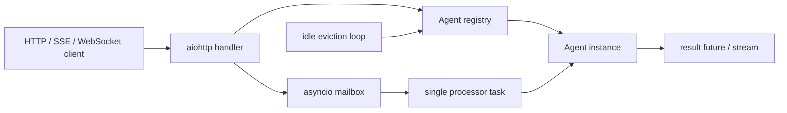
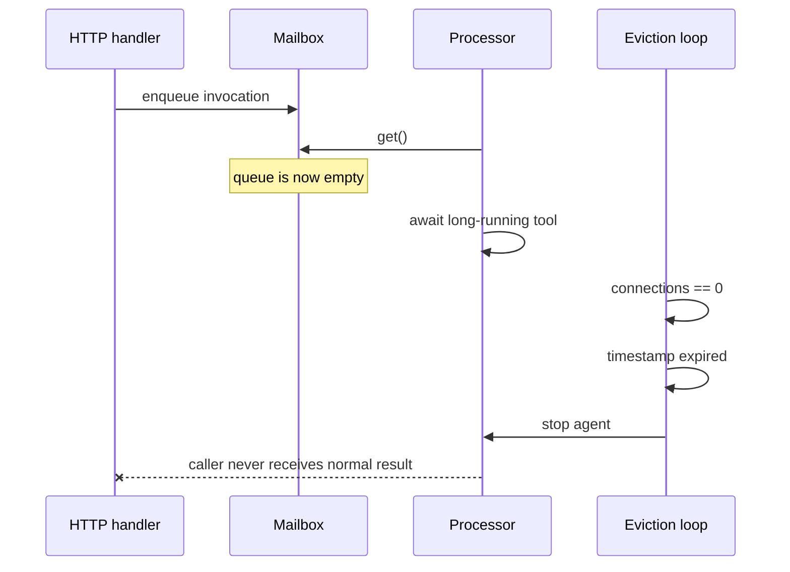
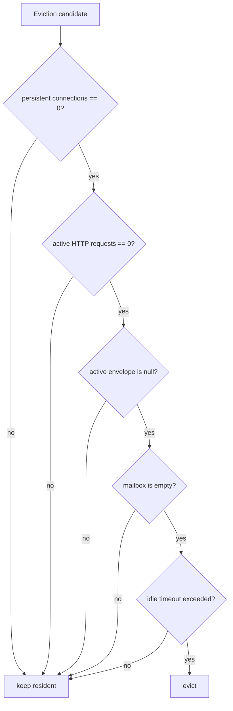

An agent in `ai-query` can live longer than any one request. The server creates it on demand, gives it a mailbox, routes HTTP and streaming calls into it, and evicts it after it has been idle long enough.

In August 2026, that last part was wrong.

An agent could be halfway through a long tool call with no WebSocket connected. Its mailbox processor had already taken the request from the queue, so the queue looked empty. Its last-activity timestamp was old because beginning work did not update it.

To the caller, the agent was still working. To the eviction loop, it had no connections, no queued work it knew about, and an expired timestamp.

The server stopped it.

This was not fixed by increasing the five-minute timeout. We had modeled idleness as elapsed time plus connection count, when idleness was actually a protocol spanning the HTTP handler, agent registry, mailbox queue, processor task, and caller futures.

The fix was to make every layer state whether it still owned work.

## The agent server in one minute

`AgentServer` is a multi-agent `aiohttp` server. A request addresses an agent by ID. If the agent is not resident, the server creates or hydrates it and stores it in an in-memory registry.

```python
@dataclass
class AgentMeta:
    agent: Any
    last_activity: float = field(default_factory=time.time)
    connection_count: int = 0
```

Each agent owns an `asyncio.Queue`. Requests do not directly mutate agent state; they become envelopes and the mailbox processor handles them serially.

```python
@dataclass
class _Envelope:
    kind: str
    payload: Any
    future: asyncio.Future | None = None
    connection: Connection | None = None
    ctx: ConnectionContext | None = None
    signal: AbortSignal | None = None
    call_observer: _AgentCallEventObserver | None = None
```

The serialized mailbox is the actor boundary:

```python
async def _process_mailbox(self) -> None:
    while self._running:
        envelope = await self._mailbox.get()

        try:
            result = await self._handle_envelope(envelope)
            if envelope.future is not None and not envelope.future.done():
                envelope.future.set_result(result)
        except Exception as error:
            if envelope.future is not None and not envelope.future.done():
                envelope.future.set_exception(error)
        finally:
            self._mailbox.task_done()
```



Serialization made agent state easier to reason about. It also created another lifecycle boundary. Once a request entered the mailbox, the HTTP layer and the agent layer each knew only part of its state.

## The eviction rule looked reasonable

The original eviction loop ran in the background and checked each resident agent:

```python
async def _eviction_loop(self) -> None:
    if self._config.idle_timeout is None:
        return

    check_interval = min(60.0, self._config.idle_timeout / 2)

    while True:
        await asyncio.sleep(check_interval)
        now = time.time()

        for agent_id in list(self._agents.keys()):
            meta = self._agents.get(agent_id)
            if meta is None:
                continue

            if (
                meta.connection_count == 0
                and now - meta.last_activity > self._config.idle_timeout
            ):
                await self.evict(agent_id)
```

The default idle timeout was 300 seconds. An agent with a live WebSocket was protected by `connection_count`. Everything else depended on `last_activity`.

The predicate encoded an assumption:

```text
no persistent connections + old timestamp = no work
```

That assumption held for a quiet chat client. It did not hold for REST actions, long-running HTTP streams, nested agent calls, or work already removed from the queue.

## There were three invisible kinds of work

The failure became obvious when we stopped asking "when was this agent last touched?" and asked "who currently owns the right to stop this agent?"

### 1. An HTTP request is not a persistent connection

The server tracked WebSocket and SSE connections, but a normal invocation could remain inside an agent for minutes without incrementing `connection_count`.

```python
result = await agent.handle_request({
    "action": "invoke",
    "payload": payload,
})
```

From the HTTP handler's perspective this request was active. From `AgentMeta`, the agent still had zero connections.

### 2. A queue can be empty because work has started

Checking `not self._mailbox.empty()` would not have been sufficient.

`asyncio.Queue.get()` removes an item before `_handle_envelope()` begins. During the entire tool call, the queue may report empty:



The queue knew what was pending. It did not know what was in flight.

### 3. A caller future can outlive the processor that owned it

Eviction calls `agent.stop()`. Stopping cancelled the mailbox processor task, but the original implementation did not explicitly settle the active envelope's future or drain queued envelopes.

```python
async def stop(self) -> None:
    self._running = False
    if self._processor_task is not None:
        self._processor_task.cancel()
        try:
            await self._processor_task
        except asyncio.CancelledError:
            pass
        self._processor_task = None
```

The processor was gone, but callers could still be awaiting futures only that processor could complete.

The bug was therefore larger than premature eviction. Shutdown did not have a complete ownership-transfer rule.

## What the race looked like

The smallest reproduction used an agent that blocked on an event:

```python
started = asyncio.Event()
release = asyncio.Event()

class BlockingAgent(Agent):
    async def handle_invoke(self, payload):
        started.set()
        await release.wait()
        return {"done": True}
```

We started an invocation, waited until it was inside `handle_invoke`, made its activity timestamp look expired, and ran one eviction pass:

```python
server = AgentServer(
    BlockingAgent,
    config=AgentServerConfig(idle_timeout=300),
)
child = server.get_or_create("child")
await child.start()

result = asyncio.get_running_loop().create_future()
child.enqueue("invoke", {}, future=result)
await started.wait()

server._agents["child"].last_activity = 0
await server._evict_idle_agents(now=301)
```

At this instant:

| Signal             | Value                  | What it incorrectly suggested   |
| ------------------ | ---------------------- | ------------------------------- |
| `connection_count` | `0`                    | nobody is using the agent       |
| `last_activity`    | older than 300 seconds | the agent is idle               |
| `mailbox.empty()`  | `True`                 | there is no work                |
| processor task     | awaiting `release`     | the agent is actively executing |
| result future      | pending                | a caller still depends on it    |

The processor task and result future were the truth. The eviction policy could not see either one.

## Fix A: HTTP requests acquire a liveness lease

We added `active_requests` to the registry metadata:

```python
@dataclass
class AgentMeta:
    agent: Any
    last_activity: float = field(default_factory=time.time)
    connection_count: int = 0
    active_requests: int = 0
```

Then we wrapped request ownership in an async context manager:

```python
@asynccontextmanager
async def track_request(self, agent_id: str) -> AsyncIterator[None]:
    meta = self._agents[agent_id]
    meta.active_requests += 1
    meta.last_activity = time.time()

    try:
        yield
    finally:
        meta.active_requests -= 1
        meta.last_activity = time.time()
```

Every request path that hands work to an agent holds that lease until the response finishes:

```python
async def handle_invoke(self, request: web.Request) -> web.Response:
    agent_id = request.match_info["agent_id"]
    agent = await self._hydrate_or_404(agent_id)
    body = await request.json()
    payload = body.get("payload", body)

    async with self.server.track_request(agent_id):
        result = await agent.handle_request({
            "action": "invoke",
            "payload": payload,
        })

    return web.json_response(result)
```

The same wrapper went around chat, streaming chat, named actions, and the generic request handler. The `finally` is important: successful responses, exceptions, and client-side cancellations all release the lease and refresh the idle clock.

This is reference counting for in-flight HTTP ownership. It is deliberately separate from persistent connection counting because they represent different lifetimes.

## Fix B: the mailbox exposes pending and active work

The mailbox needed to distinguish an envelope waiting in the queue from the envelope currently being executed.

We added `_active_envelope`:

```python
class Agent:
    def __init__(self, ...):
        self._mailbox: asyncio.Queue[_Envelope] = asyncio.Queue()
        self._processor_task: asyncio.Task | None = None
        self._active_envelope: _Envelope | None = None
        self._running = False

    @property
    def is_busy(self) -> bool:
        return self._active_envelope is not None or not self._mailbox.empty()
```

The processor owns that field for exactly the duration of an invocation:

```python
async def _process_mailbox(self) -> None:
    while self._running:
        try:
            envelope = await self._mailbox.get()
        except asyncio.CancelledError:
            break

        self._active_envelope = envelope
        try:
            result = await self._handle_envelope(envelope)
            if envelope.future is not None and not envelope.future.done():
                envelope.future.set_result(result)
        finally:
            self._active_envelope = None
            self._mailbox.task_done()
```

There is no gap where the envelope belongs to neither the queue nor the processor:

```text
queued envelope  ->  active envelope  ->  settled future
```

`is_busy` is true for the first two states. Eviction is legal only after the transition to the third.

## Fix C: define idleness as the absence of all owners

The server now composes the signals from both layers:

```python
def is_agent_busy(self, agent_id: str) -> bool:
    meta = self._agents.get(agent_id)
    return bool(
        meta is not None
        and (meta.active_requests > 0 or meta.agent.is_busy)
    )
```

The new eviction predicate is:

```python
async def _evict_idle_agents(self, now: float) -> None:
    idle_timeout = self._config.idle_timeout
    if idle_timeout is None:
        return

    for agent_id in list(self._agents.keys()):
        meta = self._agents.get(agent_id)
        if meta is None:
            continue

        if (
            meta.connection_count == 0
            and not self.is_agent_busy(agent_id)
            and now - meta.last_activity > idle_timeout
        ):
            await self.evict(agent_id)
```



Time is now the final condition, not the definition of idleness.

## Fix D: cancellation must settle every owned future

Protecting active agents from idle eviction does not remove explicit eviction or server shutdown. Those paths still cancel work, and cancellation needs a contract.

We added helpers for the active and queued envelopes:

```python
@staticmethod
def _cancel_envelope(envelope: _Envelope) -> None:
    if envelope.call_observer is not None:
        envelope.call_observer.close()

    if envelope.future is not None and not envelope.future.done():
        envelope.future.cancel()

def _cancel_queued_envelopes(self) -> None:
    while True:
        try:
            envelope = self._mailbox.get_nowait()
        except asyncio.QueueEmpty:
            return

        self._cancel_envelope(envelope)
        self._mailbox.task_done()
```

`stop()` drains the queue after the processor has stopped:

```python
async def stop(self) -> None:
    self._running = False

    if self._processor_task is not None:
        self._processor_task.cancel()
        try:
            await self._processor_task
        except asyncio.CancelledError:
            pass
        self._processor_task = None

    self._cancel_queued_envelopes()
    await self.on_stop()
```

There was one Python-specific edge in the processor. `asyncio.CancelledError` is cancellation control flow, not a normal application exception. A handler can also raise it without the processor task itself being cancelled.

We needed to cancel that envelope's future, but only stop the processor when the processor task had actually received cancellation:

```python
except asyncio.CancelledError:
    self._cancel_envelope(envelope)

    task = asyncio.current_task()
    if task is not None and task.cancelling():
        raise
```

This distinction preserves the mailbox after an individual action is cancelled. The next envelope can still run.

## The tests are the state machine

The fix added seven lifecycle tests. Each one establishes ownership explicitly with `asyncio.Event` instead of depending on sleep timing.

| Test                             | Invariant                                                         |
| -------------------------------- | ----------------------------------------------------------------- |
| Active mailbox invocation        | An expired agent is retained while `_active_envelope` is set      |
| Active HTTP request              | An expired agent is retained while `active_requests > 0`          |
| Handler tracking                 | The lease covers the entire request and returns to zero afterward |
| Truly idle agent                 | An unowned expired agent is still evicted                         |
| Stop with active and queued work | Both caller futures are cancelled                                 |
| Explicit eviction                | Active invocation is cancelled and removal completes              |
| Per-action cancellation          | One cancelled envelope does not kill the mailbox processor        |

The central test forces the old race without waiting five minutes:

```python
child.enqueue("invoke", {}, future=result)
await started.wait()

server._agents["child"].last_activity = 0
await server._evict_idle_agents(now=301)

assert "child" in server.list_agents()
assert child.is_busy is True
assert server.is_agent_busy("child") is True

release.set()
assert await result == {"done": True}

server._agents["child"].last_activity = 0
await server._evict_idle_agents(now=301)
assert "child" not in server.list_agents()
```

The last assertion matters as much as the first. A liveness fix that prevents all eviction is a memory leak with better availability.

## The end state

| Work state                    | Connection count | Active requests | Active envelope | Queue       | Evictable after timeout |
| ----------------------------- | ---------------: | --------------: | --------------- | ----------- | ----------------------- |
| Connected WebSocket           |             `1+` |             any | any             | any         | No                      |
| REST handler awaiting agent   |              `0` |            `1+` | maybe           | maybe       | No                      |
| Mailbox executing nested work |              `0` |             `0` | set             | maybe empty | No                      |
| Mailbox has pending work      |              `0` |             `0` | null            | non-empty   | No                      |
| Completed, recently active    |              `0` |             `0` | null            | empty       | No                      |
| Completed and expired         |              `0` |             `0` | null            | empty       | Yes                     |

We also exposed `active_requests` and `busy` in the optional agent-list endpoint. Liveness stopped being a hidden inference available only to the eviction loop:

```json
{
	"id": "research-agent",
	"connections": 0,
	"active_requests": 1,
	"busy": true,
	"last_activity": 1787503017.4
}
```

There were no production incident counts attached to this commit, so I will not pretend that changing the predicate produced a neat percentage graph. The concrete result is narrower and testable: an agent with a request, active envelope, or queued envelope cannot be selected by idle eviction; once those owners release it and the timeout expires, it can.

## Why increasing the timeout is not a fix

A larger timeout reduces how often the race wins. It does not make the state model correct.

If an agent call can last longer than the timeout, the bug returns. If the timeout becomes effectively infinite, resident agents accumulate. If a server deploy explicitly evicts an agent, unresolved futures still hang unless shutdown settles them.

The useful question is not "what timeout is safe?"

It is "what proof does the server require before destroying this object?"

For `ai-query`, that proof became:

```text
no persistent connections
and no active HTTP requests
and no active mailbox envelope
and no queued mailbox envelopes
and the idle deadline has passed
```

## What I would carry into another actor system

- **A timestamp is evidence, not ownership.** It can tell you when something happened. It cannot prove that nothing is happening now.
- **Queue emptiness excludes in-flight work.** The moment a consumer calls `get()`, the queue loses visibility. Track the active item separately.
- **Every asynchronous handoff needs a cancellation rule.** If a queue owns caller futures, shutdown must settle the active future and every queued future.
- **Protect work at every ingress.** REST, streaming HTTP, WebSockets, internal RPC, and mailbox calls do not share the same lifetime signal.
- **Test both halves of resource lifecycle.** Prove that busy objects survive and that genuinely idle objects still disappear.

The agent was not evicted because five minutes was too short.

It was evicted because the server had no complete definition of `busy`.
