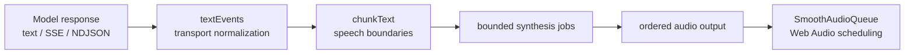
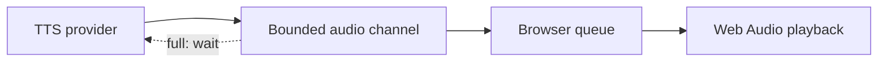

I was walking through `voicepipe`, the little package I was using to turn a streamed model response into speech, when I hit a blocker that looked like a TTS problem. The demo would start talking, then pause in strange places. Occasionally a later sentence arrived before an earlier one. Pressing stop stopped the loop, but I could still hear audio that had already made it into the browser. On a fast response, the browser ended up holding far more audio than it could play.

```ts
for await (const text of modelResponse) {
	const audio = await synthesize(text);
	player.play(audio);
}
```

The problem was that none of those values had the same meaning. The model was sending text fragments, the speech provider was producing audio values, and the browser was decoding and scheduling those values on its own timeline. I had connected three different streams with one `for await` loop and expected the loop to provide the architecture. It did not. I needed speech to start before the model finished while keeping audio in text order, letting TTS work ahead within a limit, and making sure that pressing stop reached every layer, including the provider and the browser queue.

That is what eventually became TTSPipe.

## The shape of the pipeline

The public API is intentionally small:

```ts
import { ttsPipe } from 'ttspipe';

for await (const audio of ttsPipe(modelText, {
	synthesize: (text, { signal }) => myTts.stream(text, { signal }),
	concurrency: 2
})) {
	player.enqueue(audio);
}
```

Internally, the pipeline has four jobs:



I ended up giving each part one responsibility. `textEvents` deals with transport formats, `chunkText` decides what text should be spoken together, the synthesis layer controls provider concurrency and buffering, and `SmoothAudioQueue` owns decoding and the playback clock. I kept those responsibilities separate because the text stream has its own failure modes, the provider stream has another set, and browser scheduling adds a third.

## Text chunks are the unit of ownership

I learned quickly that TTS providers need speech-shaped input. A model can emit a token in the middle of a word or several sentences in one network frame, so sending each frame directly to a provider produces too many requests and gives the provider text with poor prosody. I needed a small piece of code that could hold the stream long enough to find a useful speech boundary.

`chunkText` emits a numbered `SpeechChunk`:

```ts
type SpeechChunk = {
	index: number;
	text: string;
	reason: 'sentence' | 'clause' | 'max-length' | 'timeout' | 'flush';
	createdAt: number;
};
```

I started with a 24-character minimum, a target of 120 characters, a maximum of 240 characters, and a 700 ms maximum wait. These values describe how much unspoken text I am willing to keep in the chunker while waiting for a useful boundary; they are limits on the amount of text that can sit there before the pipeline has to make progress.

Boundary detection is conservative. A period after `Dr.` stays attached to the name, the period in `2.1` stays inside the number, and an ellipsis remains one pause. Clause boundaries take over when a chunk reaches its target size before a complete sentence arrives, which gives the provider something natural to say even when the model is still producing a long paragraph.

The chunker also normalizes the input before it applies those rules. It accepts a string, an async iterable, a `ReadableStream`, split SSE or NDJSON bytes, OpenAI-compatible events, and AI SDK `text-delta` events.

That normalization is important because cancellation belongs to the source. If the caller stops speaking, `textEvents` releases its reader or closes the upstream iterator. Stopping the outer `for await` loop without closing the source would leave the model response running in the background.

## Concurrent synthesis, ordered playback

The first scheduling decision was straightforward: waiting for chunk 0 to finish before starting chunk 1 wastes the provider’s ability to work ahead, while yielding whichever chunk finishes first makes the response speak out of order. I needed both behaviors at once: synthesis is concurrent, output is ordered.

Each text chunk becomes a job with its own audio channel. The consumer visits those channels in index order:

```ts
for await (const job of jobs) {
	let audioIndex = 0;

	for await (const audio of job.audio) {
		yield output === 'structured' ? { audio, chunk: job.chunk, audioIndex: audioIndex++ } : audio;
	}

	job.done();
}
```

I considered starting promises and sorting the results afterward, but that retains every result until the slowest request finishes. The job channel lets later synthesis start while keeping the output order fixed, so the pipeline can hide some provider latency without turning the whole response into a pile of pending audio.

The producer side has an admission limit and a synthesis limit:

```ts
const jobs = new BoundedChannel<SynthesisJob>(maxInFlightChunks);
const synthesisSlots = new Semaphore(concurrency);
const inFlightSlots = new Semaphore(maxInFlightChunks);

for await (const chunk of chunkText(source, options)) {
	await inFlightSlots.acquire(signal);

	const job = createSynthesisJob(chunk, {
		maxBufferedOutputsPerChunk,
		signal
	});

	await jobs.send(job, signal);
	void runSynthesis(job, synthesisSlots, signal);
}
```

`concurrency` controls provider calls that are actively synthesizing. `maxInFlightChunks` controls how many chunks the pipeline owns before the ordered consumer catches up. `maxBufferedOutputsPerChunk` controls how much audio one provider call may leave unconsumed.

Those limits are separate because they answer separate questions. A provider can have two active calls while the pipeline admits only one chunk ahead. A provider can also emit multiple values for one chunk, in which case the per-chunk output limit matters even when the number of active calls is small.

## Let the browser slow the provider down

The browser was slow often enough that I had to let it slow the provider down. The important part was making that slowdown explicit instead of letting it appear as a growing JavaScript array somewhere in the demo.



`BoundedChannel.send()` waits when the channel is full, and that wait happens inside the provider pump. The provider pauses while the browser decodes and plays earlier values. The public option describes unconsumed values: a sender that has produced one value and is waiting for a receiver already owns one value, so the internal channel capacity accounts for it. Output backpressure also stays outside `synthesisTimeoutMs`; once the provider has produced audio, waiting for the browser is downstream work, while the timeout covers provider invocation and provider iterator reads.

## Audio values need an explicit contract

Provider adapters returned different kinds of values, so I had to make the contract explicit. An async iterable normally means a stream of audio values. A `Uint8Array`, `ArrayBuffer`, or `ArrayBufferView` means one binary audio value. A synchronous iterable is treated as one value unless the adapter explicitly marks it as a sequence.

```ts
// One audio value.
return new Uint8Array(wavBytes);

// Several audio values.
return audioFrames([firstFrame, secondFrame]);
```

Without that distinction, I could mistake a byte array for a sequence of frames. The pipeline would still be bounded, but it would be bounding bytes rather than audio values.

The structured output mode keeps the ownership boundary visible to callers:

```ts
for await (const { audio, chunk, audioIndex } of ttsPipe(modelText, {
	output: 'structured',
	synthesize: (text, { signal }) => myTts.stream(text, { signal })
})) {
	captions.show(chunk.text);
	player.enqueue(audio);
}
```

The caller can associate every audio value with the text that produced it without guessing from timing.

## Cancellation crosses every boundary

When I pressed stop, there could be several operations waiting:

```text
model reader
chunker
job admission
provider invocation
provider iterator.next()
audio channel send
browser decode
scheduled Web Audio source
```

I created an internal `AbortController` and used its signal for all of them. The channel and semaphore implementations both remove blocked waiters when the signal aborts.

```ts
function terminate(reason: unknown) {
	if (controller.signal.aborted) return;

	controller.abort(reason);
	jobs.fail(reason);

	for (const job of activeJobs) {
		job.audio.fail(reason);
	}
}
```

Provider iterators are closed with `return()` when possible. Readable stream readers are released. A blocked producer is rejected instead of remaining attached to a full channel.

I also wanted provider failures to retain the chunk that owns them:

```ts
class TTSPipeSynthesisError extends Error {
	constructor(
		readonly code: 'provider-failure' | 'timeout',
		readonly chunk: SpeechChunk,
		message: string,
		options?: { cause?: unknown }
	) {
		super(message, options);
	}
}
```

That makes a failure actionable. I can show partial captions, retry one chunk, or stop the conversation while still knowing which text was being synthesized.

The synthesis deadline covers the provider call and every `iterator.next()`. A provider that ignores cancellation during synchronous work cannot be preempted by JavaScript, but the elapsed time is still accounted for once control returns to the pipeline.

## Playback has its own scheduler

Ordered output from TTSPipe still left one race. Browser decoding is asynchronous, so a later buffer can finish before an earlier buffer. Scheduling each decoded buffer immediately recreated the ordering bug at the last stage.

I gave `SmoothAudioQueue` one `AudioContext` and one scheduling tail. Decoding can happen ahead of playback, but the point where a buffer is placed on the audio clock is serialized:

```ts
const generation = this.#generation;
const decoded = await this.#decode(encodedAudio);

this.#assertCurrent(generation);

await this.#scheduleTail(async (previous) => {
	this.#assertCurrent(generation);

	const start = Math.max(
		this.#context.currentTime + this.#startBuffer,
		previous.endsAt + pauseForPunctuation(options.text, options)
	);

	return this.#scheduleBuffer(decoded, start, options);
});
```

The queue trims edge silence and adds punctuation-aware pauses. Crossfade is optional. An explicit pause takes precedence over crossfade so that a requested sentence break does not get erased by an overlap setting.

`clear()` creates a new generation. It also stops the sources that are currently playing:

```ts
clear() {
  this.#generation += 1;
  this.#nextStart = 0;
  this.#lastEnd = 0;

  for (const entry of this.#entries) {
    entry.source?.stop();
    entry.reject(new DOMException('Audio queue cleared', 'AbortError'));
  }

  this.#entries.clear();
}
```

A decode that started before `clear()` may still resolve. Its generation is stale, so it cannot schedule a source. `drain()` waits for decoding and natural playback completion. It gives me a clean point at which the response has actually finished.

## Chunk size can follow the provider

The chunk target is adaptive because provider latency is not constant. TTSPipe starts at 120 characters, keeps the target between 60 and 220, and moves it by 20 characters based on measured synthesis time.

```ts
if (elapsedMs < 500) {
	target = Math.min(target + 20, 220);
} else if (elapsedMs > 1200) {
	target = Math.max(target - 20, 60);
}
```

The measurement excludes time spent blocked by output backpressure. The next chunk can use a different target, but an existing chunk is never rewritten after it has been assigned to a provider. That keeps ownership stable while allowing the pipeline to respond to a slower or faster provider.

## The tests focus on boundaries

The useful tests describe the edges of the system:

- a later chunk stays behind an earlier chunk;
- a blocked first chunk limits how many later chunks start;
- output buffering stays within the configured bound;
- cancellation closes the source iterator and settles blocked sends;
- a provider failure includes its owning chunk;
- a provider that hangs on `next()` reaches the synthesis deadline;
- output backpressure leaves that deadline untouched;
- out-of-order decoding leaves playback order unchanged;
- `clear()` prevents stale decoded audio from being scheduled;
- `drain()` waits for natural playback completion.

Those boundaries are the reason TTSPipe is separate from the voice agent itself. The agent decides what to say. The TTS pipeline decides how text becomes ordered audio under finite capacity. The browser queue decides when that audio belongs on the clock.

No single layer is responsible for the whole conversation. Each layer owns the state it can make correct.
