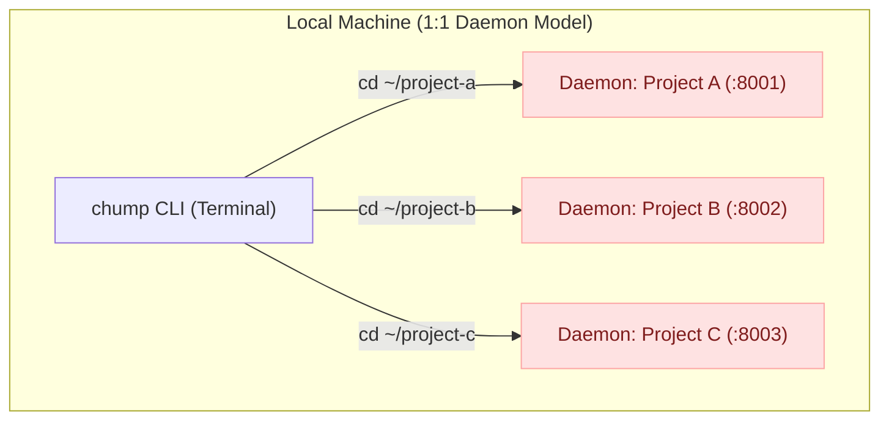
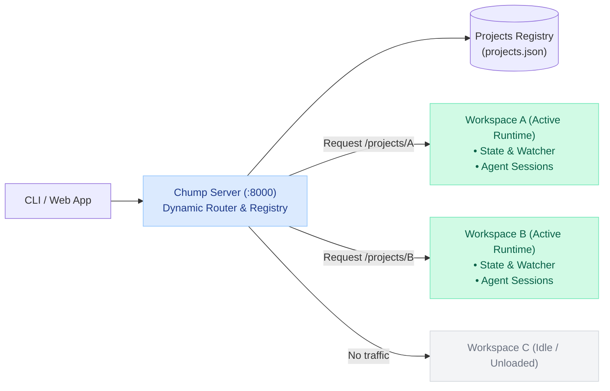

When I started building Chump (an AI coding agent harness built on top of `ai-query`), I split it into a classic client/server architecture: a Python backend (`chump-server`) for agent loops, tool executions, and file watchers; and a TypeScript frontend for the interactive CLI and web interface.

In the beginning, the server model was dead simple: **one workspace, one background daemon process.**

Whenever you navigated into a project directory and ran `chump`, the CLI silently forked a Python child process bound specifically to that path. That daemon claimed an available local port, spun up file watchers, and managed all agent sessions for that single codebase.



For local single-directory tinkering, this felt frictionless. But the moment we wanted remote execution and a collaborative web app, the 1:1 daemon model completely broke down.

### The Breaking Point: Remote Multi-Tenancy

When hosting the agent runtime on a remote VPS or dev server, you cannot SSH into the machine to fork a new Python process and hunt for available ports every time someone opens a new repository.

If you try to keep that model alive remotely, you end up writing an ad-hoc operating system process manager:

1. **Port sprawl & firewall friction:** Every new workspace needs another port opened, tracked, and reverse-proxied.
2. **Resource waste:** 20 idle projects mean 20 separate Python runtime baselines, duplicate imports, and orphaned zombie processes.
3. **Fragmented state:** No single place to query what workspaces exist, what sessions are active, or where errors are happening.

We did not need twenty daemons. We needed **one control plane**.

### The New Architecture: In-Process Workspace Runtimes

We gutted the per-workspace daemon model and rebuilt `chump-server` as a single multi-project control plane.

A single `uv run chump-server` instance runs on one port (`:8000`), handles project routing, and lazily mounts project runtimes in-process using `asyncio` task trees.



#### 1. Static Routes with Dynamic Dispatch

Instead of dynamic servers, we mount unconditional project-scoped routes at startup. Project identification happens directly through the URL path:

```python
# chump_server/main.py
def on_app_setup(self, app: web.Application) -> None:
    # Global control plane & project registry
    app.router.add_get("/projects", self.list_projects)
    app.router.add_post("/projects", self.register_project)
    app.router.add_delete("/projects/{project_id}", self.unregister_project)

    # Project-scoped runtime endpoints
    app.router.add_get("/projects/{project_id}/health", self.project_health)
    app.router.add_get("/projects/{project_id}/sessions", self.project_sessions)
    app.router.add_post("/projects/{project_id}/sessions", self.create_session)
    app.router.add_get("/projects/{project_id}/files", self.project_files)
    app.router.add_get("/projects/{project_id}/events", self.project_ws_events)
    app.router.add_post("/projects/{project_id}/terminal", self.project_terminal)
```

#### 2. Lazy In-Memory Hydration

When a request hits `/projects/{project_id}/...`, the control plane checks an in-memory dictionary:

```python
# chump_server/runtime_manager.py
class RuntimeManager:
    def __init__(self, registry: ProjectRegistry):
        self.registry = registry
        self._active_runtimes: dict[str, WorkspaceRuntime] = {}

    async def get_or_create(self, project_id: str) -> WorkspaceRuntime:
        if project_id in self._active_runtimes:
            return self._active_runtimes[project_id]

        project_meta = await self.registry.get(project_id)
        if not project_meta:
            raise web.HTTPNotFound(text=f"Project {project_id} not registered")

        # Spin up asyncio tasks, file watchers, and session state in-process
        runtime = await WorkspaceRuntime.boot(path=project_meta.path)
        self._active_runtimes[project_id] = runtime
        return runtime
```

No process forks. No port allocations. If 50 projects are registered, idle ones consume nothing more than an entry in `projects.json`.

### Before vs After

| Metric / Behavior | Per-Workspace Daemons (Before) | Unified Control Plane (After) |
| :--- | :--- | :--- |
| **Port Management** | 1 port per active project (`:8001`, `:8002`, ...) | Single fixed port (`:8000`) |
| **Process Overhead** | ~45 MB baseline Python heap *per workspace* | 1 shared Python process (~60 MB total idle) |
| **Project Discovery** | None (client had to guess or store ports) | Central `/projects` registry API |
| **Remote Deployment** | Complex (dynamic reverse proxy / ssh tunneling) | Simple (single reverse proxy / VPN tunnel) |
| **Lifecycle** | Orphaned daemons lingered after CLI exited | Controlled graceful shutdown & timeout idle evictions |

### The Realities and Tradeoffs

Unifying everything under one roof solved our architecture bottlenecks, but it introduces tradeoffs you need to handle explicitly:

#### 1. Auth and Blast Radius
In standalone mode, `uv run chump-server` has zero authentication by default. The bearer-token authentication layer only injects when running as a managed local service.

> **warning:** if you expose `chump-server` to `0.0.0.0` over the public internet without a reverse proxy (like Cloudflare Access or Tailscale) or token auth, you are exposing arbitrary file read/write and terminal execution across every registered project.

#### 2. Client Target Migration
On the TypeScript frontend, supporting both legacy direct servers and new multi-project control planes requires an explicit target abstraction:

```typescript
// client/src/api/target.ts
export type ApiTarget =
  | { kind: 'direct'; baseUrl: string }
  | { kind: 'control-plane'; baseUrl: string; projectId: string };

export function buildProjectUrl(config: ChumpConfig, path: string): string {
  // Legacy fallback: single-workspace direct server
  if (config.apiTarget.kind === 'direct') {
    return `${config.apiTarget.baseUrl}${path}`;
  }
  // Modern multi-project control plane
  const { baseUrl, projectId } = config.apiTarget;
  return `${baseUrl}/projects/${encodeURIComponent(projectId)}${path}`;
}
```

### The Takeaway

Building agent harnesses often lures you into thinking about prompts, tools, and models first. But the moment you move from local prototypes to production collaboration, your biggest headaches are classic systems problems:

- Process isolation vs. memory efficiency
- Port management vs. unified routing
- Clean lifecycle boundaries for idle resources

Killing the per-workspace daemon was not flashy AI research. It was boring, foundational plumbing—and it made the entire system significantly more resilient.
