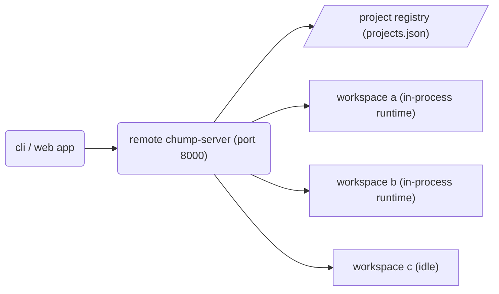

when i started building chump (my ai coding agent on top of `ai-query`), i split it into a client/server architecture. it uses a python backend for the heavy lifting, and a typescript frontend for the cli (and eventually a web app, because `ai-query` is built for real-time collaboration).

in the beginning, the server architecture was dead simple: one workspace, one daemon process.

when you navigated to a project folder and typed `chump`, the cli would silently fork a background python child process (a daemon) bound _specifically_ to that directory. that daemon would claim a local port, manage the file watcher, and run the agent sessions for that single codebase.

it was a delightfully simple mental model for local development.

but there was a catch. to actually make the collaborative web app useful and host the backend on a remote machine, the 1:1 daemon model completely falls apart.

you can't be manually ssh-ing into a remote box to fork a new OS-level process and allocate a random port every time you want to add a different project folder. if you do that, your agent framework effectively turns into a distributed process manager, and that gets messy fast.

so i went rogue and killed the per-workspace daemons entirely.

we re-architected `chump-server`. now, a single `uv run chump-server` instance acts as a full multi-project control plane. one remote server, many workspaces.

instead of spawning a whole new daemon for every folder, the server mounts unconditional project routes (`/projects/{project_id}/...`) right at startup. it keeps a centralized registry backed by a simple `projects.json` file.

```python
# chump_server/main.py
def on_app_setup(self, app: web.Application) -> None:
    # Project registry
    app.router.add_get("/projects", self.list_projects)
    app.router.add_post("/projects", self.register_project)

    # Per-project dynamic routes
    app.router.add_get("/projects/{project_id}/health", self.project_health)
    app.router.add_get("/projects/{project_id}/sessions", self.project_sessions)
    app.router.add_get("/projects/{project_id}/files", self.project_files)
    # ...and everything else a coding agent needs
```

when an API request hits for a specific project, the server checks its in-memory dictionary. if the workspace runtime isn't active, it lazily spins it up _in-process_. no heavy OS forks, just a new set of asyncio tasks managing that specific folder's state, file watcher, and agent sessions.



this is what gives you the full remote control plane under one roof. you get the project registry (list, add, remove), per-workspace health checks, file crud, websocket event channels, and integrated terminals, all served cleanly from a single API and a single port.

but putting all that power in one remote server comes with some realities you have to deal with:

1. **auth is on you (for now):** if you run `uv run chump-server` in plain mode, there is zero auth. the bearer-token middleware only injects when it's running as a managed local service. if you expose this unified server to the internet without a reverse proxy, vpn, or ssh tunnel, you are basically giving anyone free remote code execution across all your registered workspaces. don't do that.
2. **it plays safe by default:** it binds to `127.0.0.1`. you have to explicitly set `CHUMP_HOST=0.0.0.0` if you want to reach it remotely.
3. **the cli hasn't caught up:** the server API is fully ready to handle project switching remotely, but the typescript client isn't fully wired for it yet. right now, if you connect the cli directly to a remote url (`chump -c <url>`), it builds a "direct" target that bypasses the new `/projects/{project_id}` routes entirely. it falls back to the legacy root routes (`/sessions`, `/files`) and assumes a single-workspace connection. bridging that full project-switching routing into the remote CLI is the next piece to build.

```typescript
// client/src/api/target.ts
export function buildProjectUrl(config: ChumpConfig, path: string): string {
	// When in direct remote mode, we fallback to the old root pathing
	if (config.apiTarget.kind === 'direct') {
		return `${config.serverUrl}${path}`;
	}
	// Otherwise, use the proper multi-project control plane
	return `${config.serverUrl}/projects/${encodeURIComponent(config.apiTarget.projectId)}${path}`;
}
```

it's not flashy ai stuff. it's just the boring, necessary plumbing to take an agent harness from a local toy to something you can actually deploy and collaborate on.
