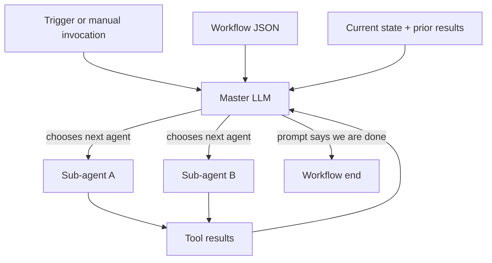
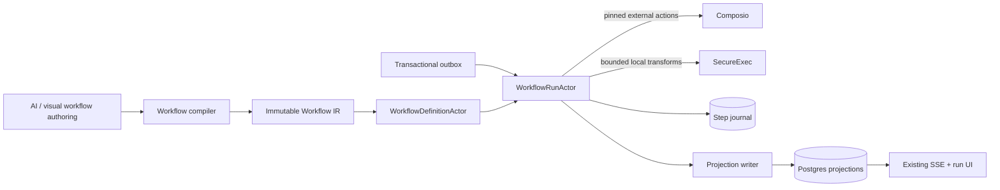
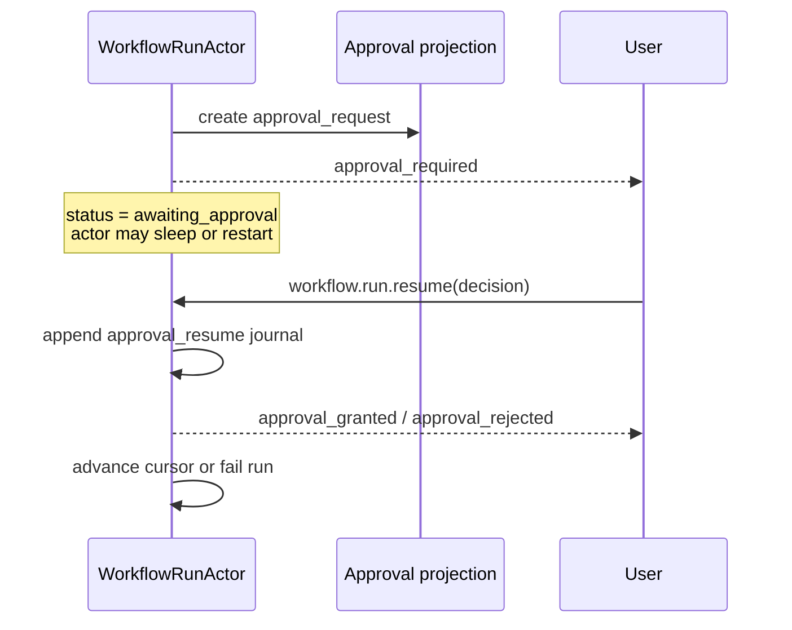
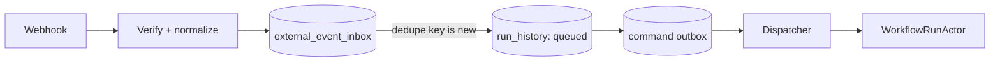
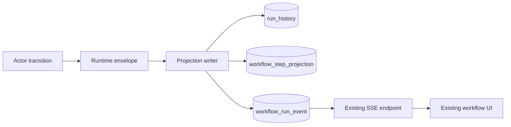

AgentSpec lets someone describe an automation in chat and turn it into a deployed workflow. The first version also let the model run that workflow.

The model received the workflow definition, the current state, and the results from earlier agents. A master-agent prompt told it to work out which step could run, preserve dependencies, pass the right state forward, stop for approval, and eventually finish the run.

That architecture was attractive for the same reason agents are attractive: we could describe what orchestration meant instead of implementing all of it.

It also meant the LLM was our scheduler, state machine, dependency resolver, and recovery mechanism.

By March 2026, the hard part was no longer getting a model to produce a useful workflow. The hard part was answering normal infrastructure questions:

- Which exact workflow version produced this run?
- Which node is allowed to execute next?
- If the process dies after sending an email, may the email be sent again?
- How does a run wait a day for approval without keeping a request open?
- Can we replay a failed run without calling GitHub, Slack, or Gmail again?
- Can a workflow created by an older builder still deploy safely?

A prompt cannot be the authoritative answer to any of those questions.

So we changed the boundary. The model could still **author** a workflow, and an explicit LLM node could still exist inside one, but the model stopped being the workflow engine.

This is how the problem turned into a compiler, why the runtime became actor-based, and what we had to make durable before we could trust retries.

## The old runtime in one minute

The original execution path had a master agent and a set of sub-agents. The master agent was handed a JSON workflow definition and instructed to infer the execution plan.

The prompt said things like:

```text
Parse the workflowDefinition.
Identify which agents can run next.
Never run an agent before its dependencies are complete.
Read tool outputs from completed sub-agents.
Merge relevant outputs into state.
Pass correct state to the next agent.
```

The master agent could then call an `executeWorkflowAgent` tool:

```ts
executeWorkflowAgent: tool({
	description: 'Execute a specific agent from the workflow definition',
	inputSchema: z.object({
		agentName: z.string(),
		currentState: z.any(),
		executedAgents: z.array(z.string()),
		agentinput: z.object({
			role: z.literal('user'),
			content: z.array(z.any()).optional()
		})
	}),
	execute: async ({ agentName, currentState, executedAgents, agentinput }) => {
		const agentConfig = workflowDefinition.find((agent) => agent.name === agentName);

		// approval, tool loading, model execution, state handling...
		return runWorkflowAgent(agentConfig, currentState, agentinput);
	}
});
```



There was real code around this. Runs were logged. Agent results were collected. Redis carried queue and stream data. Approval requests were stored in Postgres. The problem was not that the entire system lived inside one prompt.

The problem was that the final authority for **control flow** still did.

## Why prompt orchestration becomes difficult to operate

An agent can usually choose a reasonable next action. A workflow runtime needs a much stronger property: after every interruption, it must be able to prove what happened and what is legal to do next.

Those are different jobs.

### Ordering was inferred instead of enforced

The old workflow schema included prose instructions, tool names, and `next` references. The master model interpreted them at runtime. Two executions of the same definition could take different control-flow decisions because the prompt changed, the model changed, or the accumulated context was slightly different.

We could ask the model to never run a step before its dependencies. We could not make that sentence an invariant.

### State was conversational

The orchestrator received a summary of current state and previous results. That works until a result is large, a summary omits a field, or a later step needs to distinguish workflow input from trigger input from one particular node's output.

What we needed was an address:

```ts
type WorkflowDataRef =
	| { source: 'input'; path?: string }
	| { source: 'trigger'; path?: string }
	| { source: 'node'; nodeId: string; path?: string }
	| { source: 'context'; path?: string }
	| { source: 'literal'; value: JsonValue };
```

Passing a paragraph that says "use the result from the research agent" is flexible. `{ source: "node", nodeId: "research", path: "companies" }` is executable.

### Side effects did not have replay semantics

Consider a tool node that sends an email:

```text
1. call provider
2. receive success
3. write workflow state
```

If the process dies between steps 2 and 3, the durable state still says the node did not finish. A retry sends the email twice.

The model cannot reason its way out of that. On restart, the missing fact is whether the external side effect already happened.

### Waiting occupied the wrong layer

Human approval was implemented as a tool that requested approval and waited for the response. That is reasonable inside one process. It is a bad primitive for a workflow that may wait hours, survive a deploy, or move to another worker.

Approval is not a slow function call. It is a durable workflow state.

### Invocation had a race before execution even started

The manual invocation path could launch execution before the `run_history` row was durably inserted. The worker could begin emitting progress for a run the control plane had not committed yet.

This is a classic fire-and-forget race, not an AI problem. It needed a transaction and an outbox, not a better system prompt.

## The rule that clarified the redesign

We wrote one requirement that forced the pieces into place:

```text
same workflow version
+ same input envelope
+ same trigger snapshot
+ same side-effect journal
= same replayed result
```

This does not claim the outside world is deterministic. A fresh GitHub query tomorrow may return different issues. It says replaying an **existing** run must reuse the external facts already recorded for that run.

```text
replay(existing run) == deterministic
rerun(new run against live systems) == best effort, journaled, observable
```

Once we adopted that contract, an LLM could no longer own step transitions. We needed a compiled graph and a runtime cursor.

## The architecture we moved to

The new system separates four responsibilities:



| Layer                | Owns                                               | Explicitly does not own  |
| -------------------- | -------------------------------------------------- | ------------------------ |
| AI authoring         | Producing and editing a flexible workflow document | Runtime ordering         |
| Compiler             | Validation, lowering, hashing, immutable IR        | Executing tools          |
| Rivet actors         | Cursor, queues, waits, retries, resume and replay  | Inventing workflow steps |
| Composio             | Authenticated external triggers and actions        | Graph transitions        |
| SecureExec           | Bounded local transformation                       | Scheduling the workflow  |
| Postgres projections | Product-visible run, step and approval state       | The hot execution cursor |

The important boundary is between the authoring document and the runtime representation. We did not make the builder edit the low-level format directly. We added a compiler between the friendly model and the strict one.

## Fix A: compile authoring documents into runtime IR

The authoring schema is allowed to be convenient. The runtime schema is not.

We introduced `packages/workflow-ir` with a discriminated union of executable node kinds:

```ts
const BaseWorkflowNodeSchema = z
	.object({
		id: z.string().min(1),
		kind: WorkflowNodeKindSchema,
		name: z.string().min(1),
		retry: RetryPolicySchema.optional(),
		timeoutMs: z.number().int().min(1).nullable().optional(),
		metadata: JsonObjectSchema.default({})
	})
	.strict();

const ComposioActionNodeSchema = BaseWorkflowNodeSchema.extend({
	kind: z.literal('tool.composio'),
	toolkitSlug: z.string().min(1),
	actionSlug: z.string().min(1),
	connectedAccountBindingKey: z.string().min(1).optional(),
	input: WorkflowFieldMappingSchema.default({}),
	outputSchema: JsonObjectSchema.default({}),
	idempotencyKeyTemplate: z.string().min(1).optional()
}).strict();

const ApprovalNodeSchema = BaseWorkflowNodeSchema.extend({
	kind: z.literal('approval.human'),
	approvalType: z.enum(['continue', 'action', 'data']),
	title: z.string().min(1),
	context: WorkflowFieldMappingSchema.default({})
}).strict();

const WorkflowNodeSchema = z.discriminatedUnion('kind', [
	ComposioTriggerNodeSchema,
	UserInputNodeSchema,
	ComposioActionNodeSchema,
	SecureExecTransformNodeSchema,
	ApprovalNodeSchema,
	BranchNodeSchema,
	ParallelFanoutNodeSchema,
	JoinNodeSchema,
	DelayNodeSchema,
	AwaitEventNodeSchema,
	ArtifactNodeSchema,
	LlmStructuredNodeSchema,
	CompleteNodeSchema
]);
```

The whole workflow then becomes a versioned graph:

```ts
const WorkflowIRSchema = z
	.object({
		irVersion: z.literal(1),
		workflowId: z.string().min(1),
		workflowVersionId: z.string().min(1),
		title: z.string().min(1),
		entryNodeId: z.string().min(1),
		trigger: ComposioTriggerNodeSchema.nullable(),
		nodes: z.array(WorkflowNodeSchema).min(1),
		edges: z.array(WorkflowEdgeSchema),
		defaults: z.object({
			retryPolicy: RetryPolicySchema,
			timeoutMs: z.number().int().min(1).nullable()
		}),
		metadata: z.object({
			sourceSchemaHash: z.string().min(1),
			compiledAt: z.string().datetime(),
			compiledBy: z.string().min(1)
		})
	})
	.strict();
```

This representation removes several runtime questions. A tool node no longer asks the model which integration and action it meant. Those are pinned. A branch does not contain prose asking an agent to choose. It contains an expression and explicit target edges. A transform carries a permission profile. Retries and timeouts are data.

### The compiler rejects ambiguity before deployment

Parsing the schema is only the first pass. A structurally valid JSON document can still describe an impossible graph.

The compiler checks graph invariants and returns path-addressable issues:

```ts
type WorkflowCompilerIssueCode =
	| 'duplicate_node_id'
	| 'edge_source_missing'
	| 'edge_target_missing'
	| 'entry_node_missing'
	| 'workflow_cycle_detected'
	| 'workflow_unreachable_node'
	| 'invalid_data_ref'
	| 'invalid_branch_expression'
	| 'branch_fallback_missing'
	| 'join_incoming_edge_mismatch'
	| 'join_source_not_guaranteed'
	| 'parallel_child_unsupported_kind'
	| 'terminal_has_outgoing_edge'
	| 'tool_version_required';

interface WorkflowCompilerIssue {
	code: WorkflowCompilerIssueCode;
	message: string;
	path: Array<string | number>;
}
```

One of the early validation passes looks deliberately boring:

```ts
for (const edge of document.edges) {
	if (!nodeIds.has(edge.sourceNodeId)) {
		pushIssue(
			issues,
			'edge_source_missing',
			`Edge "${edge.id}" references missing source node "${edge.sourceNodeId}".`,
			['edges', edge.id, 'sourceNodeId']
		);
	}

	if (!nodeIds.has(edge.targetNodeId)) {
		pushIssue(
			issues,
			'edge_target_missing',
			`Edge "${edge.id}" references missing target node "${edge.targetNodeId}".`,
			['edges', edge.id, 'targetNodeId']
		);
	}
}

if (!nodeIds.has(document.entryNodeId)) {
	pushIssue(issues, 'entry_node_missing', 'Entry node does not exist.', ['entryNodeId']);
}
```

That boring code is the guarantee. The model is welcome to produce a broken reference. The compiler is not allowed to deploy it.

### Canonical input gives us stable versions

AI-authored JSON has noisy ordering. Two equivalent documents can arrive with nodes or object keys in different orders. Hashing raw JSON would create a new workflow version for meaningless changes.

We canonicalize before hashing:

```ts
function canonicalize(value: unknown): unknown {
	if (Array.isArray(value)) return value.map(canonicalize);

	if (value && typeof value === 'object') {
		return Object.fromEntries(
			Object.entries(value as Record<string, unknown>)
				.sort(([left], [right]) => left.localeCompare(right))
				.map(([key, nested]) => [key, canonicalize(nested)])
		);
	}

	return value;
}

function canonicalizeWorkflow(document: WorkflowBuilderV2) {
	return JSON.stringify(
		canonicalize({
			...document,
			nodes: [...document.nodes].sort((a, b) => a.id.localeCompare(b.id)),
			edges: [...document.edges].sort((a, b) => a.id.localeCompare(b.id))
		})
	);
}

const sourceSchemaHash = createHash('sha256').update(canonicalizeWorkflow(document)).digest('hex');
```

Deployment stores an immutable `workflow_version`. A run points to that version instead of whatever happens to be the latest editable builder document.

We also wrote a compatibility compiler for the legacy schema. It accepted the deterministic subset—unique steps, at most one trigger, an acyclic `next` graph, a clear root and terminal—and returned explicit issues for the rest. Migration became a compile report instead of a promise that old prompt behavior would somehow remain identical.

## Fix B: make one actor own one run

Compilation answers what the program is. The runtime still needs to answer where the program currently is.

Each run became a `WorkflowRunActor` identified by `runId`:

```ts
interface WorkflowRunState {
	runId: string;
	workflowId: string;
	workflowVersionId: string;
	status:
		| 'queued'
		| 'running'
		| 'awaiting_approval'
		| 'waiting_event'
		| 'success'
		| 'failure'
		| 'cancelled';
	currentNodeId: string | null;
	completedNodeIds: string[];
	pendingNodeIds: string[];
	failedNodeId: string | null;
	inputEnvelope: Record<string, JsonValue>;
	triggerSnapshot: Record<string, JsonValue> | null;
	variableState: Record<string, JsonValue>;
	pendingApproval: {
		approvalRequestId: string;
		nodeId: string;
	} | null;
}
```

The actor accepts a small command protocol:

```ts
const WorkflowActorCommandSchema = z.discriminatedUnion('type', [
	WorkflowRunStartCommandSchema, // workflow.run.start
	WorkflowRunReplayCommandSchema, // workflow.run.replay
	WorkflowRunResumeCommandSchema, // workflow.run.resume
	WorkflowRunCancelCommandSchema // workflow.run.cancel
]);
```

Node dispatch is code, not model output:

```ts
switch (node.kind) {
	case 'tool.composio':
		return this.executeComposioNode(input);
	case 'transform.secureexec':
		return this.executeSecureExecNode(input);
	case 'approval.human':
		return this.executeApprovalNode(input);
	case 'branch.expr':
		return this.executeBranchNode(input);
	case 'parallel.fanout':
		return this.executeParallelFanoutNode(input);
	case 'join.all':
		return this.executeJoinNode(input);
	case 'delay.timer':
		return this.executeDelayNode(input);
	case 'await.event':
		return this.executeAwaitEventNode(input);
	case 'artifact.write':
		return this.executeArtifactNode(input);
	case 'llm.structured':
		return this.executeLlmStructuredNode(input);
	case 'complete':
		return this.executeCompleteNode(input);
}
```

This switch is less magical than asking a model what should happen. That is exactly why it is useful. The compiler decides whether the graph is valid; the actor executes only the node at its cursor; the edge table decides what becomes eligible next.

### Approvals became states, not open promises

When the actor reaches `approval.human`, it writes an approval projection, emits `approval_required`, changes status to `awaiting_approval`, and stops executing.



The resume command must carry the data implied by its reason:

```ts
function assertResumePayload(command: WorkflowRunResumeCommand) {
	if (command.reason === 'approval_decision' && !command.approvalDecision) {
		throw new Error('Approval resumes require an approval decision.');
	}

	if (command.reason === 'external_event' && !command.eventName) {
		throw new Error('External-event resumes require an event name.');
	}
}
```

Timers and external events use the same idea. They write what they are waiting for, suspend the run, and resume through a typed command. No request needs to poll for 24 hours.

## Fix C: put creation behind an inbox and outbox

We wanted a run to exist durably before anything could execute it.

For a manual invocation, the API now creates the run and command together:

```text
BEGIN
  INSERT run_history(status = 'queued', workflow_version_id = ...)
  INSERT workflow_run_command_outbox(type = 'workflow.run.start', run_id = ...)
COMMIT

dispatcher -> WorkflowRunActor(run_id)
```

For a trigger, there is one extra durable boundary:

```text
verify webhook signature
  -> INSERT external_event_inbox(dedupe_key, payload_snapshot)
  -> INSERT run_history(status = 'queued')
  -> INSERT workflow_run_command_outbox(...)
  -> COMMIT
  -> dispatch to WorkflowRunActor
```



The inbox prevents duplicate deliveries from creating duplicate runs. The outbox prevents a run from starting without its database record. Both manual and triggered runs enter the actor through the same command path.

## Fix D: journal side effects before trusting retries

The actor cursor tells us which node is current. It does not by itself tell us whether an external action happened before a crash.

Every side-effecting or nondeterministic node therefore gets a journal entry:

```ts
interface WorkflowStepJournalEntry {
	id: string;
	runId: string;
	nodeId: string;
	attempt: number;
	kind:
		| 'composio_call'
		| 'secureexec_run'
		| 'approval_wait'
		| 'approval_resume'
		| 'timer_wait'
		| 'event_wait'
		| 'artifact_write'
		| 'llm_result';
	requestSnapshot: Record<string, JsonValue>;
	responseSnapshot: Record<string, JsonValue> | null;
	externalId: string | null;
	status: 'running' | 'success' | 'failure';
	startedAt: string;
	finishedAt: string | null;
}
```

For Composio calls, the adapter creates a stable fingerprint over the action contract:

```ts
function createRequestFingerprint(input: {
	toolkitSlug: string;
	actionSlug: string;
	connectedAccountId: string;
	toolVersion: string;
	args: Record<string, JsonValue>;
}) {
	return stableStringify({
		toolkitSlug: input.toolkitSlug,
		actionSlug: input.actionSlug,
		connectedAccountId: input.connectedAccountId,
		toolVersion: input.toolVersion,
		args: input.args
	});
}
```

Before executing, it checks the idempotency ledger:

```ts
const previous = await ledger.findByIdempotencyKey({
	connectedAccountId: request.connectedAccountId,
	idempotencyKey: request.idempotencyKey
});

if (previous) {
	if (previous.requestFingerprint !== requestFingerprint) {
		throw new ComposioActionAdapterError(
			'composio_idempotency_collision',
			'The idempotency key is already bound to a different request.'
		);
	}

	if (previous.status === 'success' && previous.output) {
		return { status: 'success', output: previous.output };
	}
}
```

An idempotency key is not permission to return any old result. It is bound to the connected account, action, version, and canonical arguments. Reusing the same key for different inputs is a hard error.

This matters because "retry three times" is unsafe unless the runtime knows whether the previous attempt reached the provider. Retries are a policy. Idempotency and journaling are what make that policy survivable.

## Replay means reading, not re-executing

Replay mode starts another run against the same immutable workflow version, but side-effecting nodes look up successful journal entries from the source run.

```ts
private async tryReplayNode(input: ExecuteNodeInput) {
  if (!input.state.replaySourceRunId) return null;

  switch (input.node.kind) {
    case "tool.composio":
      return this.replayComposioNode(input);
    case "transform.secureexec":
      return this.replaySecureExecNode(input);
    case "approval.human":
      return this.replayApprovalNode(input);
    case "delay.timer":
    case "await.event":
      return this.replayWaitNode(input);
    case "artifact.write":
      return this.replayArtifactNode(input);
    default:
      return null;
  }
}
```

A replayed tool node requires the recorded result:

```ts
const replayEntry = await journal.findLatestEntry({
	runId: state.replaySourceRunId,
	nodeId: node.id,
	kind: 'composio_call'
});

if (!replayEntry) {
	throw new WorkflowRunActorError(
		'workflow_run_replay_entry_missing',
		`No composio_call journal entry exists for node ${node.id}.`
	);
}

const result = ComposioActionExecutionResultSchema.parse(replayEntry.responseSnapshot);

variableState[node.id] = result.output;
```

It still emits normal step and completion projections, annotated with `replayedFromJournal: true`, so the UI sees a coherent run. What it does not do is send the email, create the ticket, or mutate the repository again.

## We kept the UI contract as a projection

Replacing the runtime did not require replacing every product surface.

The Svelte UI already understood events such as:

```text
workflow_start
workflow_resumed
agent_started
step
agent_completed
approval_required
approval_granted
approval_rejected
workflow_end
```

The actor emits more precise internal events—`node_started`, `node_completed`, `node_failed`—and a projection writer maps runtime state into `run_history`, `workflow_step_projection`, `workflow_run_event`, and `approval_request`.



Postgres is the product-facing read model. The run actor is the execution authority. Keeping those roles separate let us change the engine while preserving the event contract the frontend already consumed.

## What changed, structurally

We did not have reliable production latency or success-rate measurements attached to this migration, so I am not going to manufacture a before-and-after performance graph. The verifiable improvement was in the guarantees the architecture could express.

| Concern           | Prompt-orchestrated runtime     | Compiled actor runtime                                |
| ----------------- | ------------------------------- | ----------------------------------------------------- |
| Workflow identity | Mutable builder JSON            | Immutable version + source hash                       |
| Next step         | Chosen by master LLM            | Derived from validated edges and cursor               |
| Data flow         | Summarized conversational state | Typed references to input, trigger, node or literal   |
| Invalid graphs    | Discovered while running        | Rejected during compilation                           |
| External actions  | Runtime tool selection          | Pinned toolkit, action, account binding and version   |
| Manual start      | Fire-and-forget launch          | Run row + command in one transaction                  |
| Trigger delivery  | Direct execution path           | Verified inbox + dedupe + outbox                      |
| Approval          | In-process polling              | Durable wait state + resume command                   |
| Retry safety      | Best effort                     | Idempotency ledger + attempt journal                  |
| Replay            | Ask the system to try again     | Reuse recorded side-effect results                    |
| UI state          | Runtime-specific logs           | Postgres projections behind the existing SSE contract |

The migration landed across the final days of March 2026. The commit sequence is almost an architecture diagram by itself: IR, compiler, compatibility fixtures, database tables, actor skeletons, direct Composio adapters, idempotency, graph execution, approvals, waits, replay, projections, SSE compatibility, compile-and-promote deployment, and queued invocation.

Then the first integration bug arrived: code modules produced during authoring could be lost between preview, reset, and deploy. The fix had to preserve them in client state, include them in the deploy request, and recover them from the persisted workflow when absent.

That bug was useful. It proved the compiler boundary was real. Source code was no longer incidental chat context; it was a deployable artifact that had to be hashed, validated, bundled, stored, and attached to the exact workflow version that referenced it.

## This was not solved with a better prompt

It would have been much cheaper to add more instructions to the master orchestrator:

```text
IMPORTANT: never repeat a successful external action.
IMPORTANT: always preserve all prior state.
IMPORTANT: continue from exactly the right step after a restart.
```

Those sentences describe the desired behavior. They do not implement it.

The replacement required new packages, database tables, compatibility compilation, actor message schemas, secure execution policies, provider adapters, journal repositories, projections, and tests for graph execution and replay. It also required deciding which flexibility we were willing to remove.

The compiler rejects workflows whose only execution contract is prose. Code-mode nodes are not deployable by default. Branching must consume structured data. External tools must be pinned. Unsupported legacy graphs fail with an issue list instead of falling through to an agent and hoping.

That is the trade: fewer workflows are ambiguously executable, and the ones that deploy have a runtime contract.

## The three things I would keep from this redesign

- **Let AI author programs; do not let prose be the program counter.** A model is good at producing and revising intent. Runtime order belongs to a state machine.
- **Retries require a record of the outside world.** Backoff is not enough. Journal requests and responses, bind idempotency keys to canonical inputs, and replay successful side effects instead of issuing them again.
- **Separate the write model from the execution model.** A friendly builder schema and a strict runtime IR can evolve independently when a compiler is the explicit contract between them.

## A small test for your own agent workflow system

Take one production workflow and pause it immediately after its most expensive or dangerous side effect. Kill the runtime before the next state write. Then bring it back.

If you cannot answer—using durable data, not model judgment—whether that side effect will happen again, you do not have resumable workflows yet.

You have a prompt that usually continues.
